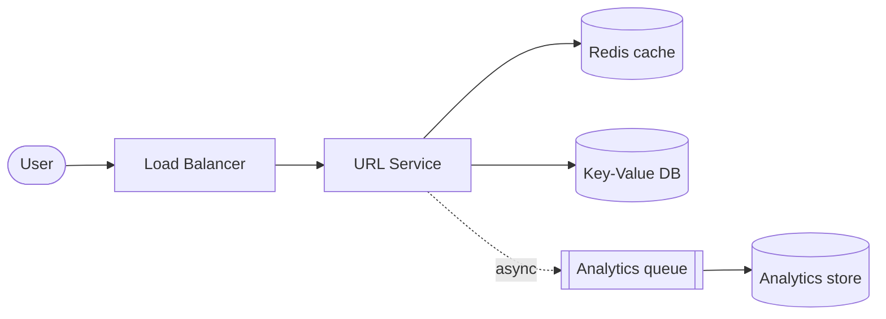

# Solution — URL Shortener

> A worked answer following the [framework](../../00-the-framework/README.md). Yours doesn't need to match exactly — check you covered the same *reasoning*.

## 1. Requirements
**Functional:** shorten a long URL → short code; redirect short → long; optional custom alias, expiry, analytics.
**Non-functional:** read-heavy (~100:1), low-latency redirects, highly available, codes unique and short.

## 2. Estimate the scale
- **Writes:** 100M/month ÷ ~2.6M sec/month ≈ **~40 writes/sec** (avg); peak ~100/sec.
- **Reads:** 100× → **~4,000 reads/sec** (avg); peak ~10k/sec. → **read-heavy → cache.**
- **Storage:** 100M/month × 12 × 5 yrs = ~6B URLs. ~500 bytes each → **~3 TB**. Modest.
- **Code length:** base62 (`a-zA-Z0-9`). 62^7 ≈ 3.5 trillion — **7 characters** is plenty.

## 3. API + data model
```
POST /urls        { "long_url": "...", "alias?": "..." } -> { "short": "short.ly/abc1234" }
GET  /{code}      -> 302 redirect to long_url
```
Data: a single key→value mapping.
```
code (PK, string)   long_url (string)   created_at   expires_at?   owner?   clicks?
```
Access pattern is a pure **lookup by code** → a key-value store fits perfectly.

## 4. High-level design


```
User → LB → URL Service → Redis (hot codes) → KV DB
                         └─ click events → queue → analytics store
```

**Redirect path:** look up code in **Redis**; on miss, read DB and populate cache; return **302**. Fire a click event asynchronously (don't block the redirect).

## 5. Deep dive — generating the short code
Three options and their trade-offs:

| Approach | How | Trade-off |
|----------|-----|-----------|
| **Counter + base62** | global incrementing ID → encode to base62 | short & collision-free, but the counter is a bottleneck/SPOF and codes are guessable/sequential |
| **Hash (e.g. MD5/SHA) + truncate** | hash the URL, take first 7 base62 chars | stateless, but **collisions** possible → must check & re-hash |
| **Random + check** | random 7-char code, check uniqueness | unguessable, simple, but needs a uniqueness check (rare retries at this scale) |

**Pick:** counter-based with a twist to avoid the SPOF — use a **distributed ID generator** (e.g. a key-range/ticket server handing each app node a block of IDs, or Snowflake-style IDs) so no single counter is hit per request. Encode to base62. This gives short, unique codes without a central bottleneck. (Mention the hash/random alternatives to show you know the trade-offs.)

## 6. Scale & harden
- **Reads** (the bottleneck): **cache** hot codes in Redis + put redirects behind a **CDN**/edge where possible. Add **read replicas**.
- **Storage/writes:** a horizontally scalable KV store (DynamoDB/Cassandra) **sharded by code**.
- **Availability:** multi-AZ, redundant LBs; the redirect path must keep working even if analytics is down (async).
- **Custom aliases / expiry:** check alias uniqueness on write; a background job purges expired codes (or check `expires_at` on read).
- **Abuse:** rate-limit creation; scan/blocklist malicious URLs.
- **Observability:** redirect latency, cache hit ratio, 4xx/5xx rate.

## 7. Trade-offs recap
- Counter/ticket IDs (short, fast) **vs** hashing (stateless but collisions) **vs** random (unguessable but check needed).
- Heavy **caching + CDN** because the workload is overwhelmingly reads.
- **KV/NoSQL** over SQL because the access pattern is a simple key lookup at large scale.
- Analytics is **async** so it never slows the user's redirect.

**With more time:** geo-distributed reads, vanity domains, fraud/malware scanning, and per-link analytics dashboards.
