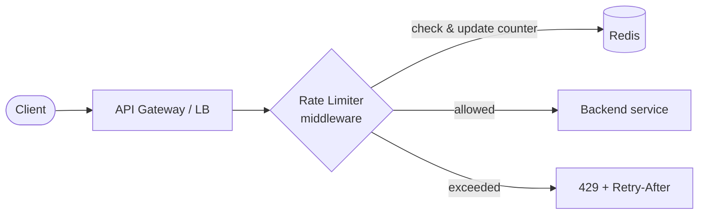

# Solution — Rate Limiter

> A worked answer following the [framework](../../00-the-framework/README.md).

## 1. Requirements
**Functional:** allow/reject based on "N requests per window per key"; return **429 + Retry-After**; limits vary by user/plan/endpoint.
**Non-functional:** ultra-low latency (hot path), accurate at scale, **shared across many servers**, highly available (must not take the API down).

## 2. Where to enforce it
- **API gateway / reverse proxy** — best default: one place, before requests hit your services. (NGINX, Envoy, Kong, cloud API gateways all support it.)
- **Per-service / middleware** — when limits are service-specific.
- **Client-side** — a nicety (avoids wasted calls) but never trustworthy on its own.

Enforce at the **edge/gateway** for global limits; optionally add per-service limits behind it.

## 3. The algorithms (the core of this question)

| Algorithm | How it works | Pros / Cons |
|-----------|--------------|-------------|
| **Fixed window counter** | count per fixed window (e.g. each minute) | simple, memory-light; ⚠️ **burst at window edges** (up to 2× limit straddling the boundary) |
| **Sliding window log** | store timestamp of every request; count those within the window | exact; ⚠️ memory-heavy at scale |
| **Sliding window counter** | weighted blend of current + previous window | smooths the edge burst, cheap; tiny approximation — **good default** |
| **Token bucket** | tokens refill at a steady rate; each request takes one; bucket has a max | allows controlled **bursts**, smooth; great general choice |
| **Leaky bucket** | requests queue and drain at a fixed rate | enforces a steady output rate; adds queueing/latency |

**Pick:** **token bucket** (allows sensible bursts, simple to reason about) or **sliding window counter** (smooth, cheap). Mention fixed-window's boundary-burst flaw to show depth.

## 4. Distributed design
Counters must be **shared across all app/gateway servers** → keep them in a fast central store, **Redis**.



```
Client → Gateway → [Rate limiter check against Redis] → allowed? → service
                                                       → no → 429 Retry-After
```

**Key in Redis:** `ratelimit:{user_id}:{endpoint}`. Update **atomically** (Redis `INCR`+`EXPIRE`, or a small **Lua script** / token-bucket script) so concurrent requests across servers don't race.

## 5. Deep dive — making it correct & fast
- **Atomicity:** do the read-modify-write in one atomic op (Lua script) to avoid race conditions across servers.
- **Latency:** Redis is in-memory (~sub-ms). Co-locate it; use connection pooling. For extreme scale, a **local token bucket per node synced periodically** trades a little accuracy for zero per-request network hop.
- **Response:** return `429` with `Retry-After` and `X-RateLimit-Remaining` headers so clients back off politely.

## 6. Scale & harden
- **Scale Redis:** cluster/shard by key; replicas for HA.
- **Fail open vs fail closed:** if Redis is unreachable, decide deliberately — usually **fail open** (allow traffic) so the limiter never causes an outage, while alerting. (Fail closed only if limiting is a hard security requirement.)
- **Hot keys:** a single huge customer can hammer one key → consider per-key sharding or local buckets.
- **Observability:** track 429 rate, limiter latency, Redis health; alert if rejection rate spikes.

## 7. Trade-offs recap
- **Token bucket / sliding-window counter** over fixed window (avoids edge bursts).
- **Central Redis** for shared state (accurate) vs **local buckets** (faster, slightly inaccurate).
- **Fail open** to protect availability vs **fail closed** for strict enforcement.
- Enforce at the **gateway** for one consistent choke point.

**With more time:** tiered limits per plan, dynamic limits, distributed quotas across regions, and abuse detection.
