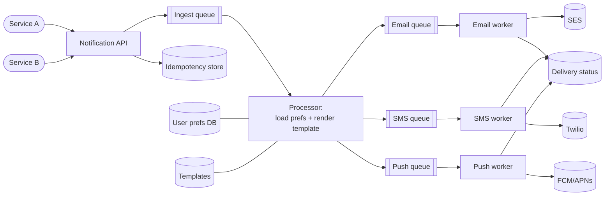

# Solution — Notification System

> A worked answer following the [framework](../../00-the-framework/README.md).

## 1. Requirements
**Functional:** services trigger notifications; deliver via email/SMS/push; respect user preferences/opt-outs; templating; (optional) delivery status.
**Non-functional:** high throughput & bursty, reliable (no loss, retry), **async** (caller doesn't wait), no duplicates, extensible to new channels.

## 2. Estimate
Tens of millions/day → ~hundreds/sec average, but **spikes** (marketing blast, outage storm) of many thousands/sec. Conclusion: must **buffer bursts** and process async → **message queue** is the backbone.

## 3. High-level design


```
Services → Notification API → Ingest queue → Processor (prefs + template)
        → per-channel queues → channel workers → providers (SES / Twilio / FCM)
                                              → delivery-status store
```

## 4. Walk the flow
1. **API** receives an event, validates, writes it to an **ingest queue**, returns immediately (async). Caller is unblocked.
2. **Processor** consumes the event, looks up **user preferences** (which channels, opt-outs) and renders the **template**, then **fans out** one message per chosen channel onto **per-channel queues**.
3. **Channel workers** (email/SMS/push) consume their queue and call the third-party **provider**. They record **delivery status**.

## 5. Deep dive — reliability (the heart of this question)
- **Don't lose notifications:** durable queues; the API persists before acking. Work isn't removed from a queue until a worker **acks** success.
- **Provider down / rate-limiting you:** workers **retry with exponential backoff + jitter**; respect provider rate limits; after N failures move the message to a **dead-letter queue (DLQ)** for inspection/replay. A failing provider only backs up its own queue — other channels keep flowing.
- **No duplicates:** queues are **at-least-once**, so the same message can arrive twice. Make delivery **idempotent** using a **notification/idempotency key** (event_id + channel) checked in a store before sending. (Exactly-once delivery to a third party is impossible; aim for exactly-once *effect*.)
- **Per-channel isolation (bulkheads):** separate queues/workers so a slow SMS provider doesn't delay emails.

## 6. Scale & harden
- **Absorb spikes:** the ingest + per-channel queues buffer bursts; **autoscale workers** off queue depth.
- **Throughput:** partition queues; scale workers horizontally; batch where providers allow.
- **Preferences/templates:** cache hot preferences; store templates with versioning.
- **Priority:** separate high-priority (password reset/OTP) from bulk marketing via different queues so critical messages aren't stuck behind a blast.
- **Observability:** queue depth, send success/failure per provider, DLQ size, end-to-end latency; alert on rising failure rate or DLQ growth.

## 7. Trade-offs recap
- **Async + queues** everywhere → resilience and burst absorption, at the cost of **eventual** delivery (not instant).
- **At-least-once + idempotency** → no loss, no duplicate *effect*, accepting that true exactly-once delivery isn't possible.
- **Per-channel queues/workers (bulkheads)** → isolation, at the cost of more moving parts.
- **Priority queues** so OTPs don't wait behind marketing.

**With more time:** scheduling/quiet-hours, user-facing delivery receipts, A/B templates, and analytics on open/click rates.
