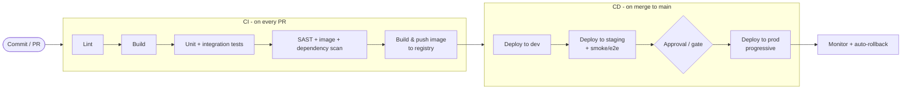

# Solution — CI/CD Pipeline

> A worked answer. The signal here is **deployment safety + security + automation**, not just "I'd use Jenkins/GitHub Actions".

## 1. Requirements
**Functional:** on commit/PR build+test+package a container image; promote dev→staging→prod with gates; fast rollback.
**Non-functional:** fast feedback, safe deploys, secure (secrets, scanning, least privilege), fully automated/repeatable.

## 2. The pipeline shape (CI then CD)


```
PR:    lint → build → test → security scan → build & push image (immutable tag = git SHA)
Merge: deploy dev → deploy staging (+smoke/e2e) → gate → progressive prod deploy → watch → rollback if bad
```

**On a PR** run the fast, blocking checks (lint, build, unit/integration tests, scans). **On merge to main** build the artifact once and promote that *same* immutable image through environments — never rebuild per environment.

## 3. Key decisions

### Artifacts
Build the container image **once**, tag it immutably (git SHA), push to a registry. Promote the **same image** dev→staging→prod so "what you tested is what you ship".

### Deployment strategy (know the trade-offs)
| Strategy | How | Trade-off |
|----------|-----|-----------|
| **Rolling** | replace pods a few at a time | no extra cost; slow-ish; mixed versions briefly |
| **Blue-green** | stand up full new version, switch traffic | instant switch + instant rollback; **2× resources** during deploy |
| **Canary** | send a small % of traffic to new version, watch metrics, ramp up | safest; catches bad releases with real traffic; needs good metrics + automation |

**Pick canary (or blue-green)** for prod so a bad release hits few users and rolls back fast; rolling is fine for lower environments.

### Rollback
Because images are immutable and deploys are declarative (Kubernetes manifests/Helm), rollback = **redeploy the previous known-good image/manifest** (`kubectl rollout undo` / re-apply previous chart). Automate it: if canary error rate/latency breaches thresholds, **auto-rollback**.

### GitOps (strong thing to mention)
Use **pull-based GitOps** (Argo CD/Flux): the desired state lives in Git; a controller in the cluster continuously reconciles the cluster to match. Benefits: Git is the audit log, easy rollback (`git revert`), no CI system holding cluster credentials.

## 4. Security (don't skip — it's a differentiator)
- **Secrets** never in the repo: pull from a secrets manager/Vault or sealed secrets at deploy time.
- **Scan** in the pipeline: SAST, dependency/CVE scan, **container image scanning** (Trivy), IaC scanning (tfsec/checkov).
- **Sign images** and verify signatures before deploy (supply-chain integrity).
- **Least privilege:** scoped, short-lived credentials for runners; isolated/ephemeral build runners.

## 5. Make it fast
- **Cache** dependencies and Docker layers between runs.
- **Parallelise** independent jobs (lint, tests, scans).
- Run only **affected** tests on PRs where possible; keep the slow full suite for merge.
- Ephemeral, right-sized runners that **autoscale** with demand.

## 6. Reliability & observability of the pipeline itself
- Pipeline-as-code, version-controlled.
- Metrics: build time, success rate, **DORA metrics** (deploy frequency, lead time, change-failure rate, MTTR).
- Notifications on failure; flaky-test quarantine.

## 7. Trade-offs recap
- **Canary/blue-green** (safe, costlier/needs automation) vs **rolling** (cheap, slower).
- **GitOps pull** (auditable, secure) vs **push** (simpler, but CI holds cluster creds).
- **Build once, promote** the immutable artifact vs rebuilding per env (drift risk).
- Speed (caching/parallelism/affected tests) vs thoroughness (full suite) — split across PR vs merge.

**With more time:** progressive delivery with automated metric analysis (Argo Rollouts/Flagger), preview environments per PR, and policy-as-code gates (OPA).
