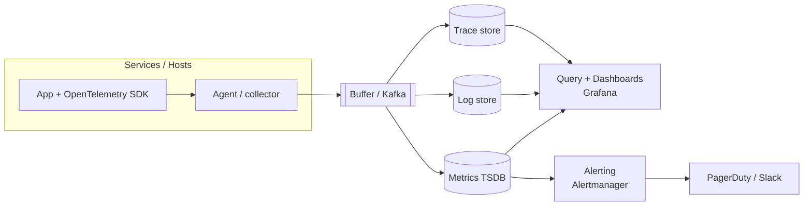

# Solution — Observability / Monitoring Platform

> A worked answer. Signal: you understand **the three pillars, the ingest pipeline, and cost/retention trade-offs**.

## 1. Requirements
**Functional:** collect metrics, logs, traces from many services; query/visualise; alert.
**Non-functional:** very high ingest, low query latency, monitoring stays up when the app is down, cost-aware.

## 2. The three pillars (frame the answer with these)
| Pillar | Question it answers | Store type |
|--------|--------------------|------------|
| **Metrics** | *Is it healthy? How much?* (numbers over time: latency, error rate, CPU) | **time-series DB** (Prometheus/Mimir/Cortex) |
| **Logs** | *What exactly happened?* (discrete events/messages) | **search/index store** (Elasticsearch/OpenSearch/Loki) |
| **Traces** | *Why is this request slow? Where's the time spent?* (request across services) | **trace store** (Tempo/Jaeger) |

Metrics are cheap and always-on (alert on these); logs and traces are richer and pricier (use for deep dives, and **sample**).

## 3. The pipeline shape


```
App (OpenTelemetry) → agent/collector → buffer (Kafka) → {metrics TSDB | log store | trace store}
                                                        → query/dashboards (Grafana)
                                                        → alerting → on-call (PagerDuty/Slack)
```

**Use OpenTelemetry** as the vendor-neutral way apps emit telemetry; a **collector** receives, batches, and routes it; a **buffer (Kafka)** absorbs spikes and decouples ingest from storage.

## 4. Deep dive — scale, cost, and cardinality
This question is really about **controlling volume and cost**:
- **Sampling traces:** you can't store every trace at scale → **tail-based sampling** (keep the interesting ones: errors, slow requests) + a small % of normal traffic.
- **Log volume:** structure logs, drop noisy/debug logs in prod, sample high-volume lines. Logs are usually the biggest bill.
- **Metric cardinality** is the classic trap: every unique label combination is a new series. A label like `user_id` or `request_id` explodes cardinality and cost — **keep labels low-cardinality**.
- **Retention tiers:** hot (fast, days) → warm → **cold/object storage** (cheap, queryable on demand) for older data. Downsample old metrics (1s → 1m → 1h).

## 5. Reliability (monitoring must outlive the app)
- Run the platform **separately** from the systems it watches (separate cluster/account/region) so an app/infra failure doesn't blind you.
- Make ingest **HA** and buffered (Kafka) so a storage hiccup doesn't drop telemetry.
- Have a **dead-man's switch** (alert if telemetry *stops* arriving — silence can mean the monitored thing or the pipeline is down).

## 6. Alerting done right (avoid alert fatigue)
- Alert on **symptoms users feel** (error rate, latency, availability), not raw causes (high CPU may be harmless).
- Tie alerts to **SLOs and error budgets**: page when the budget is burning fast, not on every blip.
- Severity tiers: **page** for user-impacting, **ticket/Slack** for the rest. Add runbooks to alerts.

## 7. Trade-offs recap
- **Metrics (cheap, always-on)** vs **logs/traces (rich, expensive → sample)**.
- **Retention vs cost:** hot/warm/cold tiers + downsampling.
- **Cardinality:** expressive labels vs cost/performance — keep labels low-cardinality.
- **Buy (Datadog) vs build (Prometheus/Grafana/OTel stack):** speed & less ops vs cost control & flexibility.

**With more time:** SLO dashboards + error-budget automation, anomaly detection, and correlating metrics↔logs↔traces (exemplars) for one-click drill-down.
