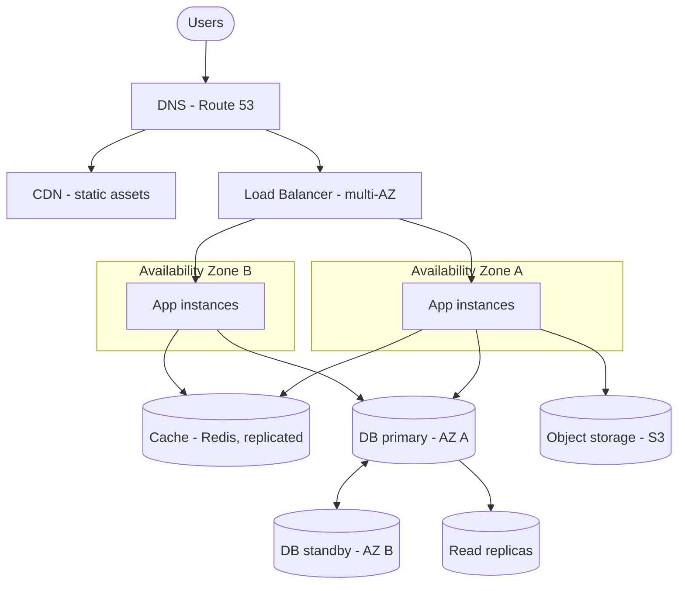

# Solution — Highly Available, Scalable Web Application

> A worked answer. Signal: **no single point of failure, multi-AZ, autoscaling, stateless tier, DB failover, DR.** (Described cloud-neutrally; AWS names in brackets.)

## 1. Requirements
**Functional:** serve web/API + relational data + static assets.
**Non-functional:** survive instance *and* whole-AZ failure; autoscale for spikes (e.g. 10× sale traffic); no SPOF anywhere; secure; cost-aware; a DR plan.

## 2. The architecture (tier by tier)


```
Users → DNS → CDN (static) + Load Balancer (spans AZs)
                              → App tier: stateless instances in AZ-A and AZ-B (autoscaling group)
                              → Cache (Redis, replicated)
                              → DB primary (AZ-A) ── sync replica ──> standby (AZ-B), + read replicas
                              → Object storage (S3) for files/assets
```

## 3. How each requirement is met

### High availability (survive AZ loss)
- Deploy every tier across **≥2 Availability Zones**. The **load balancer** is a managed multi-AZ service (redundant by design).
- App instances run in **both AZs** behind the LB with **health checks** — dead/unhealthy instances are pulled automatically.
- Database runs **primary + synchronous standby in another AZ** with **automated failover** (e.g. RDS Multi-AZ). If AZ-A dies, the standby is promoted.
- No SPOF: redundancy in DNS, LB, app, cache, and DB tiers.

### Scalability (handle 10× spikes)
- The **app tier is stateless**, so we can add/remove instances freely → **autoscaling group** scales on CPU / request count / latency (or queue depth).
- **Reads:** add **read replicas** + a **cache** (Redis) for hot data; **CDN** offloads static assets.
- **Writes** (harder): vertical scale the primary first; then shard or move write-heavy data to a store built for it if needed.

### Why stateless matters
If instances held session state, losing one would log users out and you couldn't scale freely. Push state **out**: sessions/tokens in the **cache** (or stateless JWTs), files in **object storage**, data in the **DB**. Then any instance can serve any request and scaling is trivial.

## 4. Deep dive — the database (usually the bottleneck/SPOF)
- **HA:** primary + standby in another AZ, synchronous replication, automated failover.
- **Read scaling:** read replicas; route reads to replicas, writes to primary (mind **replication lag** → read-your-writes from primary when needed).
- **Connection management:** a connection pooler to avoid exhausting DB connections as the app tier scales out.
- **Backups:** automated snapshots + point-in-time recovery; **test restores**.

## 5. Disaster recovery (whole-region failure)
State the **RPO** (how much data loss is acceptable) and **RTO** (how fast to recover), then pick a strategy by cost:
- **Backup & restore** (cheapest, slow RTO),
- **Pilot light / warm standby** (smaller copy in another region, faster),
- **Active-active multi-region** (most expensive, near-zero downtime).
Cross-region replicate backups/data; use DNS failover to the DR region.

## 6. Security & cost
- **Security:** app/DB in **private subnets**, LB in public; security groups least-privilege; secrets in a manager; encryption in transit + at rest; WAF at the edge.
- **Cost:** autoscale **down** off-peak; right-size instances; reserved/savings plans for steady baseline + on-demand/spot for bursts; CDN cuts egress.

## 7. Trade-offs recap
- **Multi-AZ** (HA within a region, modest cost) vs **multi-region** (survives region loss, expensive/complex).
- **Stateless app tier** (easy scaling) requires pushing state to cache/DB/object storage.
- **Read replicas/cache** scale reads but introduce **staleness** (eventual consistency).
- **DR posture** is a direct **cost ⇄ RTO/RPO** trade-off — pick to match the business.

**With more time:** active-active multi-region with global DB, blue-green infra, and chaos testing (game days) to verify the failover actually works.
