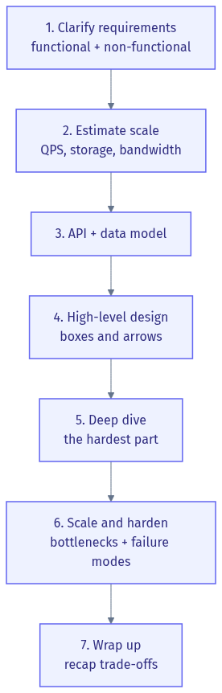
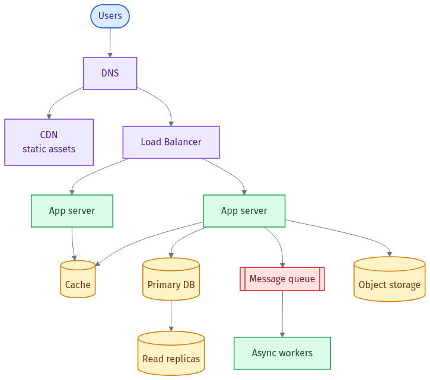
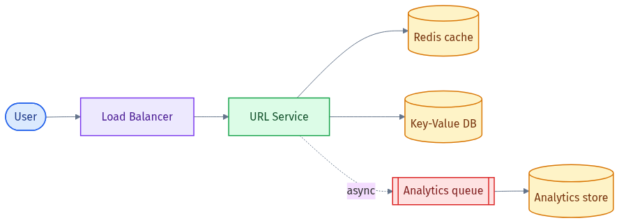
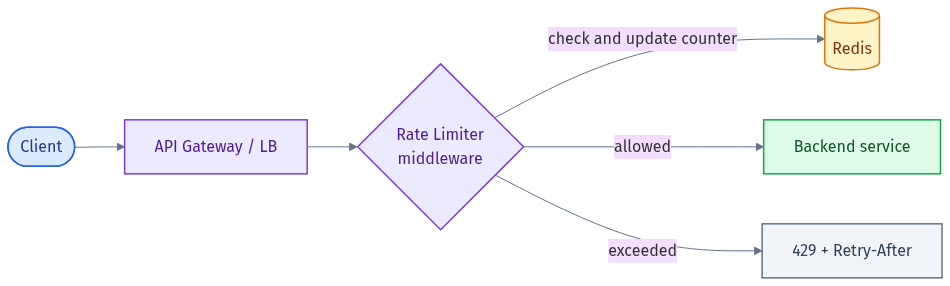
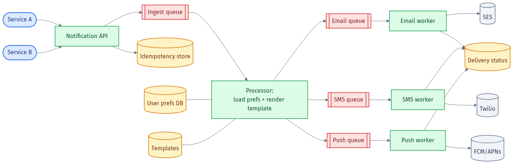
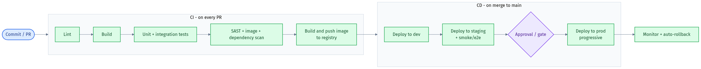
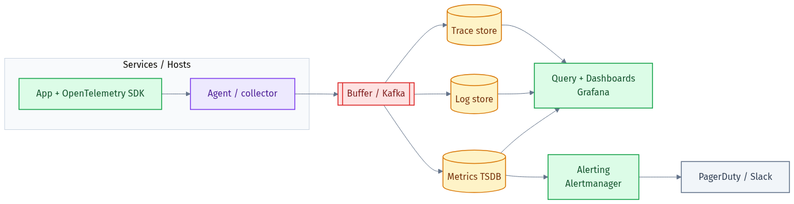
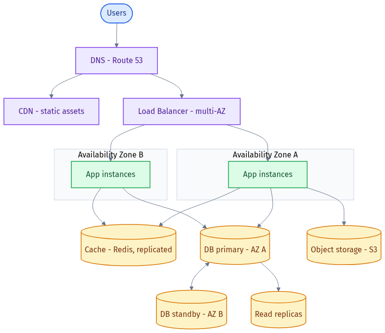

# 🖼️ Diagram Gallery

Rendered versions of every diagram in this lab — handy for quick reference, slides, or **LinkedIn posts** (where Mermaid doesn't render).

- **PNG** — drop straight into LinkedIn/slides.
- **SVG** — crisp at any size for docs/websites.
- **Source** — the editable Mermaid files live in [`src/`](src). Re-render with the steps at the bottom.

> The same diagrams render automatically inside the lab's markdown on GitHub (via Mermaid). These image files are just for use outside GitHub.

## 🎨 Colour legend

Every diagram uses the same colour scheme so component types are easy to spot at a glance:

| Colour | Means | Examples |
|--------|-------|----------|
| 🔵 Blue | **Client / caller** | users, calling services |
| 🟣 Purple | **Edge / networking** | DNS, CDN, load balancer, API gateway |
| 🟢 Green | **Compute** | app servers, services, workers |
| 🟠 Amber | **Datastore** | databases, caches, object storage |
| 🔴 Red | **Messaging** | queues, topics |
| ⚪ Grey | **External provider** | SES, Twilio, FCM, third-party APIs |

---

## The lab at a glance

### Learning path


### The 7-step framework


### Anatomy of a typical web system


---

## Classic design scenarios

### URL shortener


### Rate limiter


### Notification system


---

## DevOps / infra design

### CI/CD pipeline


### Observability platform


### Highly available, scalable web app


---

## 🔄 How to re-render these

The source diagrams are plain-text [Mermaid](https://mermaid.js.org/) in [`src/*.mmd`](src). Edit a `.mmd` file, then regenerate the images using one of:

**Option A — the [Mermaid Live Editor](https://mermaid.live)** (no install): paste the `.mmd` content, export PNG/SVG.

**Option B — the [Kroki](https://kroki.io) service** (no install, what these were made with). Example in PowerShell:

```powershell
Get-ChildItem docs\src\*.mmd | ForEach-Object {
  $body = Get-Content $_.FullName -Raw
  $name = [System.IO.Path]::GetFileNameWithoutExtension($_.Name)
  Invoke-WebRequest -Uri "https://kroki.io/mermaid/png" -Method Post -Body $body `
    -ContentType "text/plain" -OutFile "docs\$name.png"
}
```

**Option C — the official [mermaid-cli](https://github.com/mermaid-js/mermaid-cli)** (needs Node):

```bash
npx @mermaid-js/mermaid-cli -i docs/src/04-url-shortener.mmd -o docs/04-url-shortener.png
```

---

Made by **Shubham Sharma** · [GitHub](https://github.com/shubhs248) · [LinkedIn](https://www.linkedin.com/in/shubhs248)
